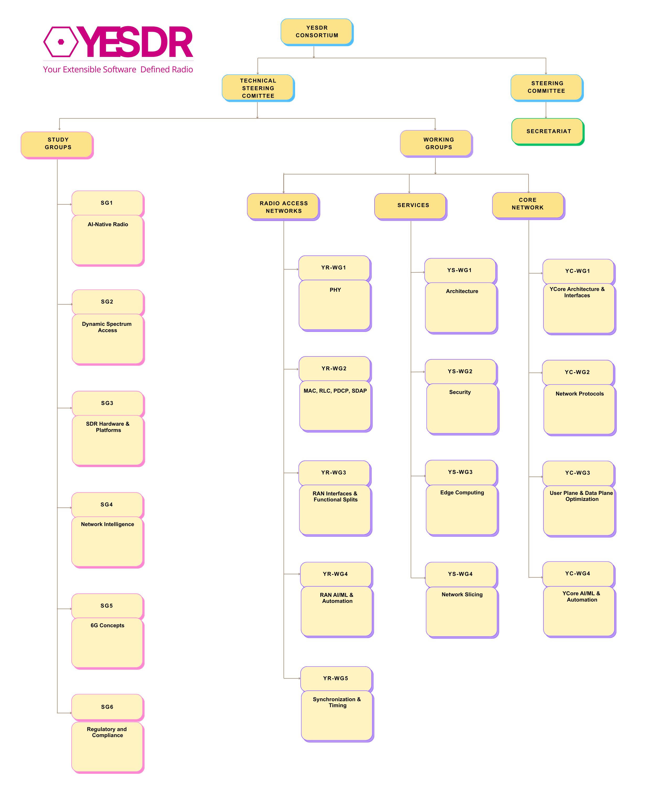

# YESDR Consortium and Governance

The **YESDR Consortium** is the organizational body responsible for the
coordination, governance, and long-term evolution of the YESDR standard.
The Consortium provides a neutral, collaborative platform for academia,
research institutions, startups, and industry to jointly develop a modular
and extensible framework for end-to-end cellular wireless systems.

---

## Scope of the Consortium

The YESDR Consortium oversees activities related to:

- Architecture and system design
- Protocol and interface specifications
- Spectrum monitoring and cognitive radio integration
- AI-driven optimization and automation in wireless systems
- Educational and research deployments
- Reference implementations and tooling

---

## Organizational Structure

### Steering Committee (SC)

The **Steering Committee** is the highest decision-making body of the YESDR Consortium.

**Responsibilities:**

- Define the strategic direction of the YESDR standard
- Approve the creation, modification, and closure of Study Groups and Working Groups
- Approve publication of YESDR Technical Specifications (TS)
- Oversee consortium policies, membership, and compliance
- Resolve escalated technical or procedural issues

**Authority:**

- Final approval of releases and major architectural changes
- Appointment or confirmation of Working Group Chairs
- Adoption and amendment of governance policies 

---

### Technical Steering Committee (TSC)

The **Technical Steering Committee (TSC)** provides technical oversight across
all Working Groups and ensures architectural consistency.

**Responsibilities:**

- Review technical outputs from Working Groups
- Ensure alignment with the YESDR architecture and roadmap
- Coordinate cross–Working Group dependencies
- Supervise the Change Request (CR) process

**Scope:**
- The TSC does not write specifications
- The TSC validates technical coherence and integration 

---

### Study Groups and Working Groups

Technical work within the YESDR Consortium is carried out through:

- **Study Groups (SGs)** – Exploratory and pre-standardization research
- **Working Groups (WGs)** – Formal specification and standard development

---

### Secretariat

The **Secretariat** provides administrative and operational support to the Consortium.

**Responsibilities:**

- Maintain official records, meeting minutes, and publications
- Manage consortium communications and mailing lists
- Coordinate membership applications and onboarding
- Support compliance and governance processes
  
---

## Decision Authority

| Activity | Responsible Body |
|--------|------------------|
| Strategic direction | Steering Committee |
| Technical coordination | Technical Steering Committee |
| Specification development | Working Groups |
| Exploratory research | Study Groups |
| Administration | Secretariat |

---

## Transparency and Compliance

- Governance processes are documented and auditable
- Decisions are recorded and published where appropriate
- Policies are reviewed periodically by the Steering Committee 

---

## Getting Involved

Organizations and individuals interested in contributing to the YESDR standard
are encouraged to:

1. Review the Consortium structure and policies  
2. Apply for membership  
3. Join relevant Study Groups or Working Groups  
4. Participate in discussions, reviews, and technical contributions 
