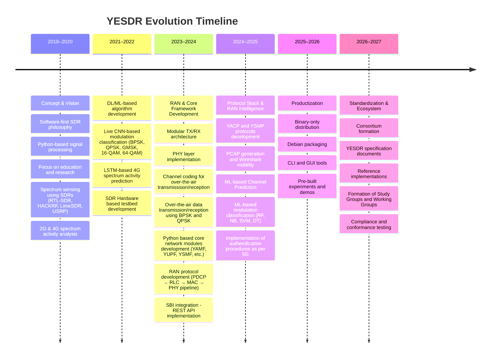

# YESDR Timeline

YESDR has evolved from a software-first SDR concept
into a protocol-aware, AI-integrated academic and product ecosystem.
The timeline below captures the key milestones in its development.

{ .yesdr-view }
 
<!--

 

-->
