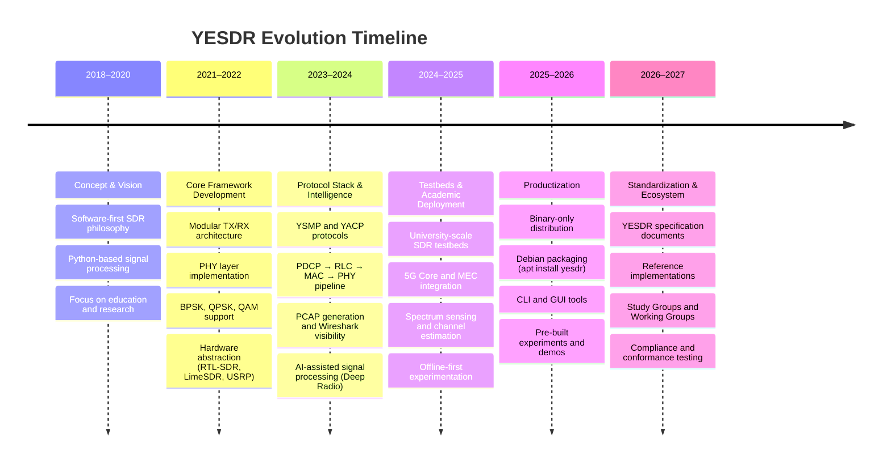

# YESDR

YESDR has evolved from a software-first SDR concept
into a protocol-aware, AI-integrated academic and product ecosystem.
The timeline below captures the key milestones in its development.

```mermaid
timeline
    title YESDR Evolution Timeline

    2018–2020 : Concept & Vision
               : Software-first SDR philosophy
               : Python-based signal processing
               : Focus on education and research

    2021–2022 : Core Framework Development
               : Modular TX/RX architecture
               : PHY layer implementation
               : BPSK, QPSK, QAM support
               : Hardware abstraction (RTL-SDR, LimeSDR, USRP)

    2023–2024 : Protocol Stack & Intelligence
               : YSMP and YACP protocols
               : PDCP → RLC → MAC → PHY pipeline
               : PCAP generation and Wireshark visibility
               : AI-assisted signal processing (Deep Radio)

    2024–2025 : Testbeds & Academic Deployment
               : University-scale SDR testbeds
               : 5G Core and MEC integration
               : Spectrum sensing and channel estimation
               : Offline-first experimentation

    2025–2026 : Productization
               : Binary-only distribution
               : Debian packaging (apt install yesdr)
               : CLI and GUI tools
               : Pre-built experiments and demos

    2026–2027 : Standardization & Ecosystem
               : YESDR specification documents
               : Reference implementations
               : Study Groups and Working Groups
               : Compliance and conformance testing
               
               
```
