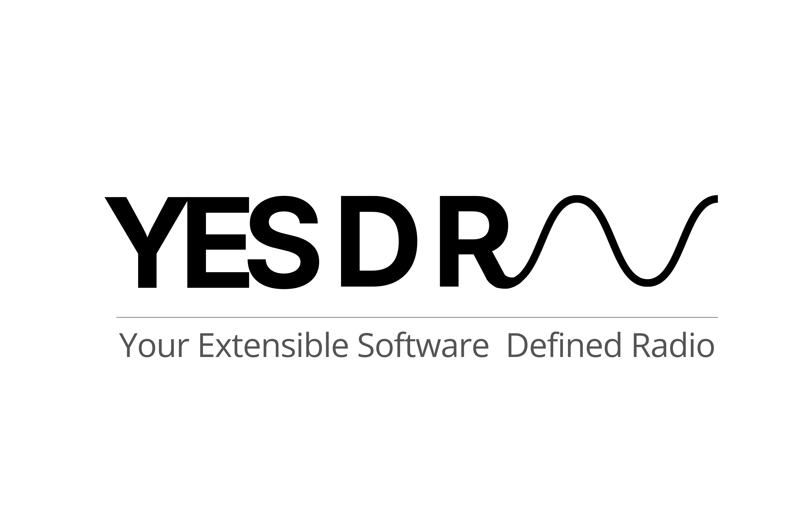

  

# An Extensible Framework for AI-Native Cellular Networks
YESDR (*pronounced “Yes Dee Are”*) is a modular standard-oriented framework for end-to-end cellular wireless experimentation from PHY to Core Network using Software-Defined Radios (SDRs).

Designed for flexibility, teaching, and research, YESDR enables AI-driven wireless innovation, including channel prediction, spectrum sensing, protocol optimization, dynamic spectrum access, traffic forecasting, and network automation. It provides a lightweight alternative to full 3GPP stacks, ideal for rapid prototyping and experimentation.

---

## Who It’s For

- Researchers and students in wireless, SDR, AI, 5G/6G
- University labs, engineering colleges, and educators
- Deep-tech startups and teams building 5G/6G testbeds
- Developers exploring new RAN/Core protocols, MEC, ORAN  

---

## Key Features

- *Research-Oriented Standard Framework*: An academic-friendly alternative to full 3GPP stacks for learning, teaching, and research. 

- *Full‑Stack Customization*: Complete control across Core Network and RAN protocols, spanning GTP and control signaling down to PDCP → RLC → MAC → PHY, enabling deep end-to-end protocol experimentation and innovation.

- *Python/C++ Dual Availability*: Python for rapid research and prototyping, with a clear path to high-performance C++ deployment.

- *Hardware-Independent*: Unified SDR abstraction enabling operation across multiple SDR platforms.

- *Community‑Driven Framework*: Open, extensible, and designed for collaborative development.

- *Interoperability Ready*: Designed to integrate with OpenAirInterface, Free5GC, Open5GS, UERANSIM, and potential ORAN‑based components for with real‑world 5G/6G experimentation.  
