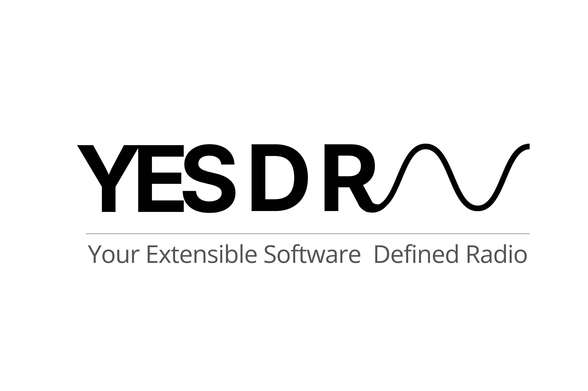

  

# YESDR Standard
**YESDR (pronounced “Yes Dee Are”)**  is a modular standard framework for the development, instruction, and experimentation of end‑to‑end cellular wireless protocols—spanning from the physical layer to the core network—utilizing Software‑Defined Radios (SDRs).Engineered for flexibility and extensibility, YesDR facilitates the integration of AI‑driven features, including Channel prediction, Protocol optimization, Dynamic spectrum access, Traffic forecasting, Spectrum sensing, Signal classification, Network automation. YESDR standard framework empowers academic researchers, educators, and startups to advance 5G/6G testbeds, develop AI‑enhanced wireless solutions, and foster innovation in future communication technologies.

---

## Who It’s For

- Academic researchers in wireless communication, SDR, and AI integration  
- University labs (ECE, CSE) and deep‑tech startups working on 5G/6G technologies  
- Organizations building 5G/6G testbeds  
- Engineering colleges and universities teaching 5G/6G standards and architecture  
- Faculty and students pursuing UG/PG projects in end‑to‑end cellular communication  
- Teams designing new core network and RAN protocols for future wireless systems  
- Makers, hobbyists, and open‑source enthusiasts exploring cellular stack development  
- Educators building lab‑based curriculum for practical 5G/6G training  
- Researchers focused on PHY‑layer innovation, protocol optimization, or MEC/ORAN integration  

---

## Key Objectives

- Enable end‑to‑end cellular experimentation using SDRs
- Integrate AI‑driven spectrum sensing and protocol optimization  
- Foster open collaboration between academia and industry  
- Provide a lightweight alternative to full 3GPP protocol stacks  

---

## Key Features of YesDR

- **Open Academic Standard**: YESDR is an academic‑friendly alternative to complex 3GPP stacks, enabling students and researchers to develop, test, and teach wireless protocols with ease.  

- **Full‑Stack Customization**: Provides complete visibility and control across **PDCP → RLC → MAC → PHY** layers, including GTP tunneling—ideal for protocol experimentation and innovation.  

- **Python/C++ Dual Availability**: Developed initially in Python for rapid prototyping and research, with seamless migration to high‑performance C++ for deployment.  

- **Named Subsystems**: Modular components such as **YUE, YBS, YCore**, and others mirror 3GPP functions in a simplified structure, making the system intuitive for teaching and rapid iteration.  

- **Hardware-Independent**: Designed to operate seamlessly across diverse SDR platforms, including Deep Radio, through a unified abstraction layer, ensuring zero vendor lock-in.

- **Community‑Driven Framework:** Built as a collaborative, open‑source project with an extensible architecture and contributor‑friendly design.  

- **Interoperability Ready**: Designed to integrate with existing tools such as **OpenAirInterface, Free5GC, Open5GS, UERANSIM**, and potential **ORAN‑based components**, bridging experimentation with real‑world 5G/6G deployments.  

---

## Site Overview

- **System Architecture:** A structured view of the [YESDR end-to-end architecture](architecture.md), including functional descriptions of the system components.

- **Technical Specifications (TS):** The [YESDR technical specification](standards/ts-00-001-overall.md) documents defining system architecture, interfaces, protocols, and functional behavior across the RAN, Core Network, and Spectrum Management domains.

- **Consortium, Groups and Governance:** Information about the [YESDR Consortium](consortium/overview.md), including its organizational structure, technical [groups](consortium/groups/index.md), and the [governance model](consortium/governance.md) under which the standard is developed and maintained.

- **Membership and Policies:** Details on [consortium membership](consortium/membership.md) categories, application procedures, and the [policies](consortium/policies.md) that govern participation, contributions, intellectual property, and standard development processe.

- **Timeline and Roadmap:** [Milestones](history/timeline.md), current status, and the [planned evolution](roadmap.md) of the YESDR standard.

- **Implementations & Tools:** Reference [implementations](implementations/protocol-tools.md), protocol tooling, and validation resources, including Wireshark dissectors for YACP and YSMP, example PCAP files, and supporting utilities for experimentation and protocol analysis.

